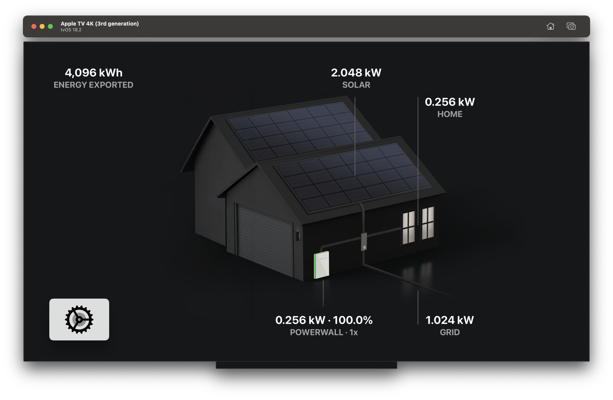

# Powerwall for AppleTV

An AppleTV application to view the current state of your Tesla Powerwall via your local network.

 <video src="powerwall-tv.mp4" width="45%" />

## Download

* Download the app from the [AppleTV App Store](https://apps.apple.com/us/app/powerwall-tv/id6743396507)
* Sign up for beta versions [TestFlight](https://testflight.apple.com/join/4EFw1RBR)

## Setup

* [Connecting Powerwall to Wi-Fi](https://www.tesla.com/en_au/support/energy/powerwall/mobile-app/connecting-powerwall-wi-fi)
* [Local API details](https://github.com/vloschiavo/powerwall2)
* Then Visit the local network IP address of your Tesla Gateway and setup your username and password.

## Sign in

Use the details above to add to this application:

* IP Address of your Tesla Gateway
* Username/email address you signed up with
* Password you set

## Privacy

This application collects no personal data, and all information entered into it is only used to connect directly to your Powerwall via your own WiFi network.

## TODO

* Add the ability to sign in with your Tesla Fleet API Key

