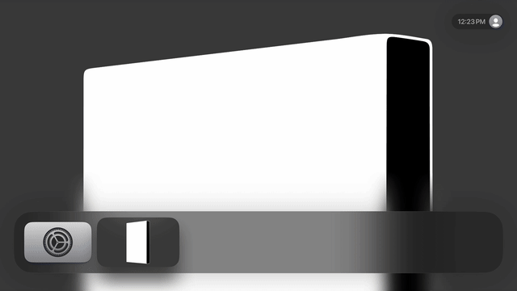
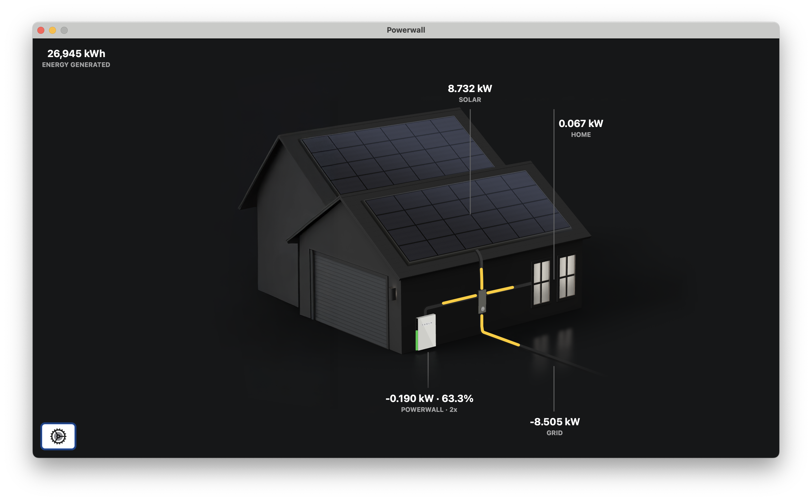
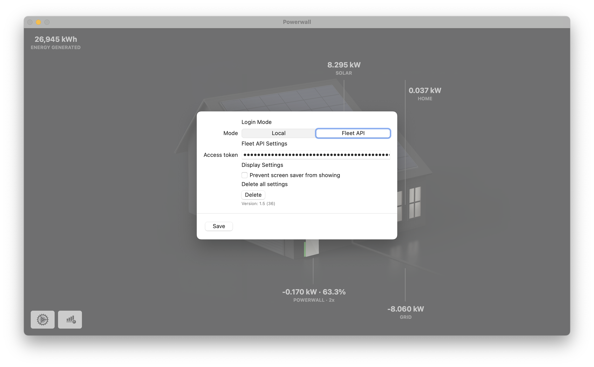

# Powerwall for AppleTV

[](https://apps.apple.com/us/app/powerwall-tv/id6743396507)
[](https://testflight.apple.com/join/4EFw1RBR)
[](https://github.com/sighmon/Powerwall-TV/actions/workflows/ci.yml)

An AppleTV/macOS application to view the current state of your Tesla Powerwall via your local network or Tesla Fleet API.

 

 

## Download

* Download the app from the [AppleTV App Store](https://apps.apple.com/us/app/powerwall-tv/id6743396507)
* Sign up for beta versions [TestFlight](https://testflight.apple.com/join/4EFw1RBR)

## Setup

### Local network

* [Connecting Powerwall to Wi-Fi](https://www.tesla.com/en_au/support/energy/powerwall/mobile-app/connecting-powerwall-wi-fi)
* [Local API details](https://github.com/vloschiavo/powerwall2)
* Then Visit the local network IP address of your Tesla Gateway and setup your username and password.

In this application:

* Select the "Local" tab in the Settings screen
* Enter the IP Address of your Tesla Gateway
* Enter the Username/email address you signed up with
* Enter the Password you set (it may be the default Gateway password if you didn't change it)
* Tap save

### Tesla Fleet API

* Select the "Fleet API" tab in the Settings screen
* The application will now ask you to login via your iPhone or iPad with your Tesla credentials via the Tesla website
* Once approved, an access token will be saved to your AppleTV Keychain so it can access your Powerwall via the Tesla Fleet API cloud

None of your Tesla credentials will be saved in the application or anywhere else. Only the access token, refresh token, and expiry date will be saved so that you don't need to authenticate each time you open the application.

## CI note

CI uses a stub `Secrets` implementation so builds can run without local credentials. The stub reads `TESLA_CLIENT_ID` and `TESLA_CLIENT_SECRET` when the `CI` build flag is set.

## Local development

Create `Powerwall-TV/Secrets.swift` with your Fleet API credentials. The file is git-ignored.

```swift
// Powerwall-TV/Secrets.swift
enum Secrets {
    static let clientID = "<your-client-id>"
    static let clientSecret = "<your-client-secret>"
}
```

## Privacy

This application collects no personal data, and all information entered into it is only used to connect directly to your Powerwall via your own WiFi network, or directly to official Tesla Fleet API servers to retrieve Powerwall data remotely.

All connection tokens are only stored in your AppleTV's Keychain.
