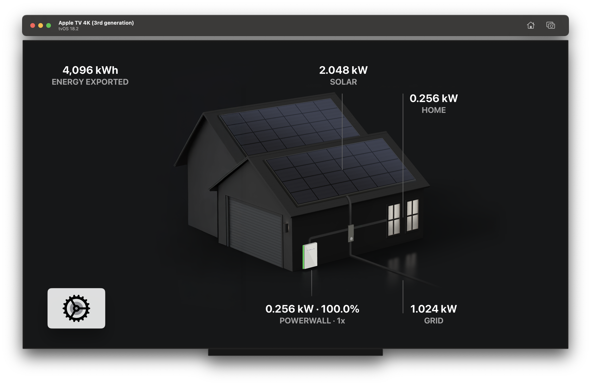
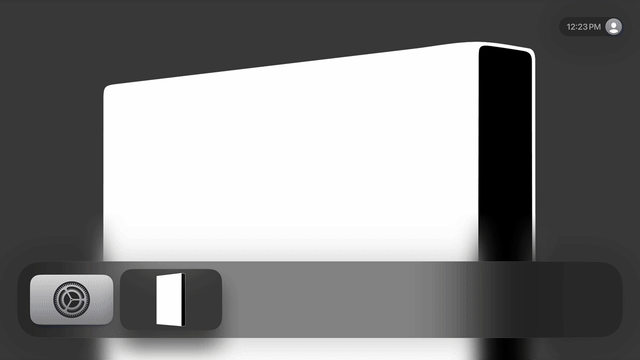
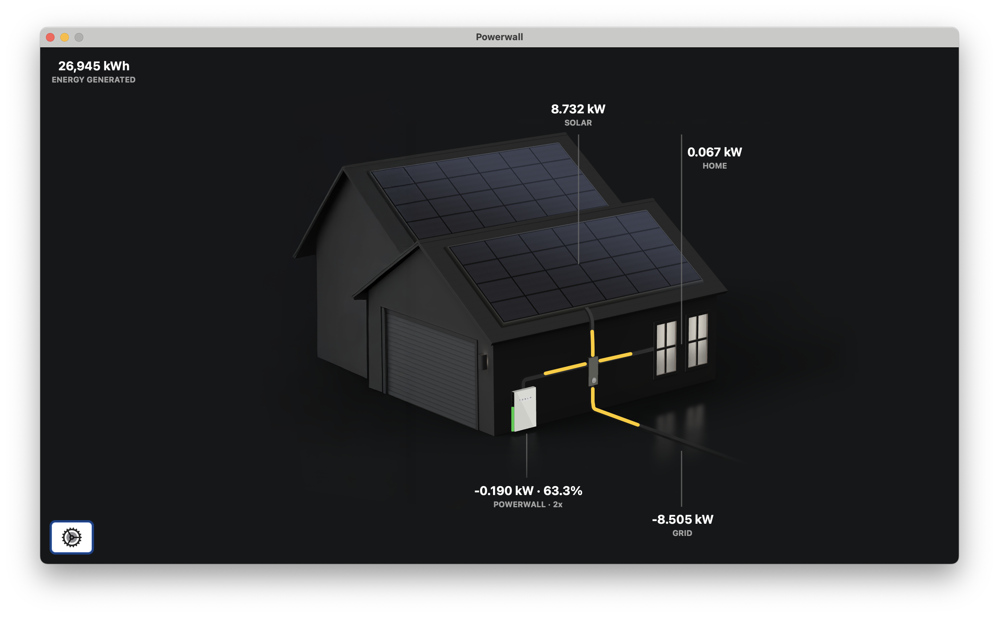
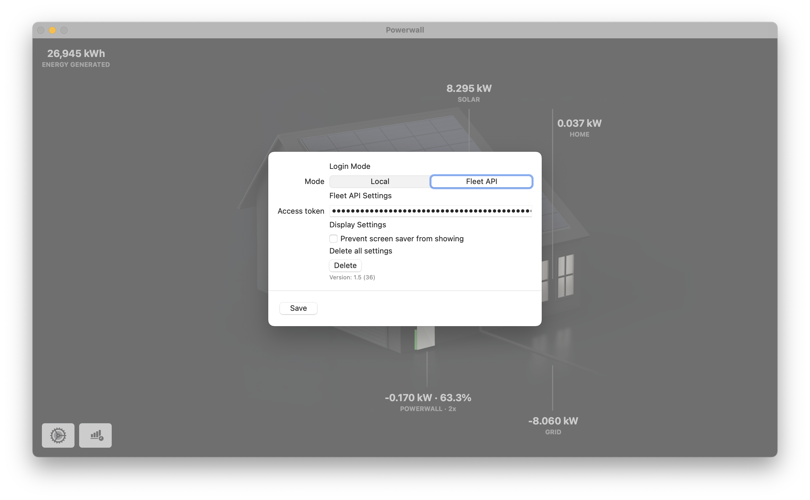

# Powerwall for AppleTV, macOS, and iPad

[](https://apps.apple.com/us/app/powerwall-tv/id6743396507)
[](https://testflight.apple.com/join/4EFw1RBR)
[](https://github.com/sighmon/Powerwall-TV/actions/workflows/ci.yml)

An AppleTV/macOS/iPad application to view and manage the current state of your Tesla Powerwall via your local network or Tesla Fleet API.

 

 

## Download

* Download the app from the [AppleTV App Store](https://apps.apple.com/us/app/powerwall-tv/id6743396507)
* Sign up for beta versions [TestFlight](https://testflight.apple.com/join/4EFw1RBR)

## Features

* Live Powerwall energy flow, battery percentage, grid status, solar generation, and home usage.
* Local Gateway connections and Tesla Fleet API cloud connections.
* Local site name display from the Gateway `site_info` endpoint.
* Optional Electricity Maps grid carbon intensity and renewable percentage display.
* Optional Wall Connector status from a local Wall Connector IP address.
* Fleet API energy history graphs and multi-site support.
* macOS menu bar display, keep-window-in-front mode, and scene layout controls.
* Beta scheduler for switching Powerwall modes at configured start and end times.

## Setup

### Local network

* [Connecting Powerwall to Wi-Fi](https://www.tesla.com/en_au/support/energy/powerwall/mobile-app/connecting-powerwall-wi-fi)
* [Local API details](https://github.com/vloschiavo/powerwall2)
* Then visit the local network IP address of your Tesla Gateway and set up your username and password.

In this application:

* Select the "Local" tab in the Settings screen
* Enter the IP Address of your Tesla Gateway
* Enter the Username/email address you signed up with
* Enter the Password you set (it may be the default Gateway password if you didn't change it)
* Optionally enter the local IP address of a Tesla Wall Connector to show charging state and power
* Tap save

### Tesla Fleet API

* Select the "Fleet API" tab in the Settings screen
* The application will now ask you to login via your iPhone or iPad with your Tesla credentials via the Tesla website
* Once approved, an access token will be saved to your AppleTV Keychain so it can access your Powerwall via the Tesla Fleet API cloud

None of your Tesla credentials will be saved in the application or anywhere else. Only the access token, refresh token, and expiry date will be saved so that you don't need to authenticate each time you open the application.

## Scheduler beta

The scheduler can switch between Self-Powered and Time-Based Control via the Tesla Fleet API. It can also schedule Off-Grid and On-Grid actions when local Gateway IP and password settings are configured, because Tesla Fleet API does not expose those islanding controls.

For reliable scheduling, keep the app open on the device that should run the schedule. iOS and tvOS background refresh is best-effort and may not fire at the exact scheduled time, especially when the device is asleep or the system has suspended the app. macOS does not use the app's `BGTaskScheduler` path, so schedules run while the app is open.

To use it:

* Enable "Show schedule (beta)" in Settings.
* Open the Scheduler button from the main screen.
* Enable "Scheduler Active".
* Add one or more schedules with start and end modes and times.
* Use "Run now" to apply any due schedules immediately.

## Grid data

If you'd like to see the carbon intensity of your grid via [electricitymaps.com](https://www.electricitymaps.com), follow these steps:

* Sign up for a [Home Assistant account/API Key](https://portal.electricitymaps.com/auth/signup/home-assistant)
* Enter your API Key and Zone (country code/state) into the Settings view of this app.
* The percentage of renewable energy in the grid, and the gCO2eq/kWh for your zone will show in the Grid label.

## CI note

CI uses a stub `Secrets` implementation so builds can run without local credentials. The stub reads `TESLA_CLIENT_ID` and `TESLA_CLIENT_SECRET` when the `CI` build flag is set.

## Local development

Create `Powerwall-TV/Secrets.swift` with your Fleet API credentials. The file is git-ignored.

```swift
// Powerwall-TV/Secrets.swift
enum Secrets {
    static let clientID = "<your-client-id>"
    static let clientSecret = "<your-client-secret>"
}
```

## Privacy

This application collects no personal data, and all information entered into it is only used to connect directly to your Powerwall via your own WiFi network, or directly to official Tesla Fleet API servers to retrieve Powerwall data remotely.

All connection tokens and local Gateway credentials are stored in the device Keychain where supported.
